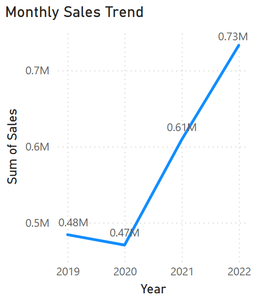
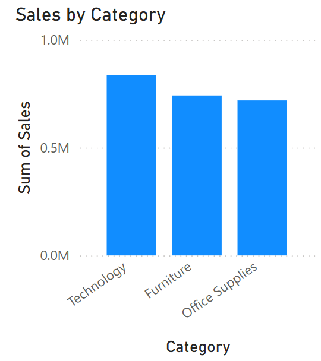
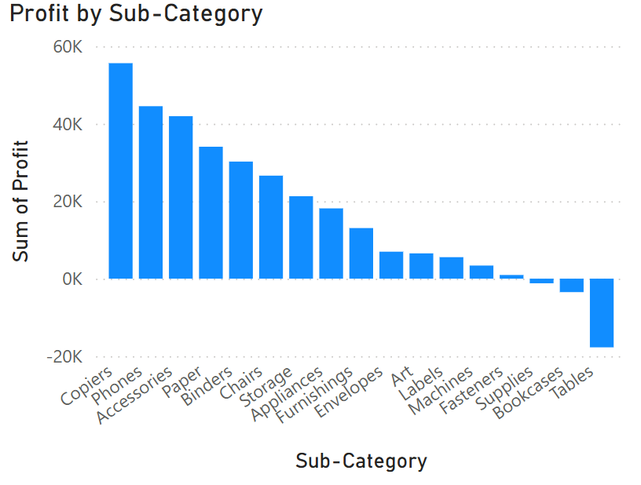
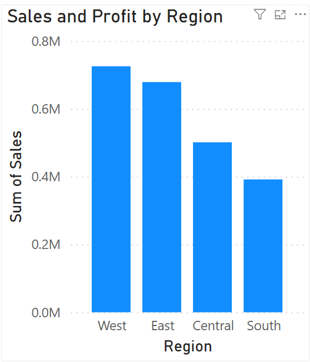

# 📊 Superstore Sales Analysis - Power BI

This project presents an interactive **Power BI Dashboard** created using the **Superstore dataset**, showcasing various insights from a fictional retail chain’s sales data across different regions, categories, and segments.

---

## 📌 Objective

To visualize and analyze sales performance across multiple dimensions using Power BI. The dashboard aims to answer business questions like:
- Which region generates the most profit?
- What is the sales trend over time?
- Which product sub-categories are underperforming?

---

## 📁 Dataset

- **Source**: Sample Superstore dataset (Excel format)
- **File**: `Superstore-Sales-Analysis-PowerBI` (Power BI file)

---

## 📈 Key Visualizations

| Screenshot                          | Description                          |
|-------------------------------------|--------------------------------------|
|  | Full dashboard overview              |
|          | Line chart showing monthly sales growth |
|              | Bar chart comparing sales by category |
|     | Bar chart highlighting profitability by sub-category |
| | Region-wise sales and profit analysis |
|                    | Slicer to filter visuals by segment  |

---

## 📌 Tools Used

- **Power BI Desktop**
- **Excel** (for source dataset)

---

## 🧠 Insights Derived

- The **West** region generated the highest profit.
- Certain sub-categories (e.g., Tables, Bookcases) are incurring losses.
- Sales peaked in **November and December**, indicating a holiday season spike.
- **Corporate segment** showed the most consistent performance across categories.

---

## 📂 Folder Structure

Superstore-Sales-Analysis-PowerBI/
│
├── Superstore-Sales-Analysis-PowerBI (Power BI file)
├── screenshots/
│ ├── Superstore Sales Dashboard.png
│ ├── monthly_sales_trend.png
│ ├── sales_by_category.png
│ ├── profit_by_subcategory.png
│ ├── sales_profit_by_region.png
└── README.md

---

## 💬 Author

**Rajat Bisht**  
🔗 [LinkedIn](https://www.linkedin.com/in/rajatbisht03)

---

